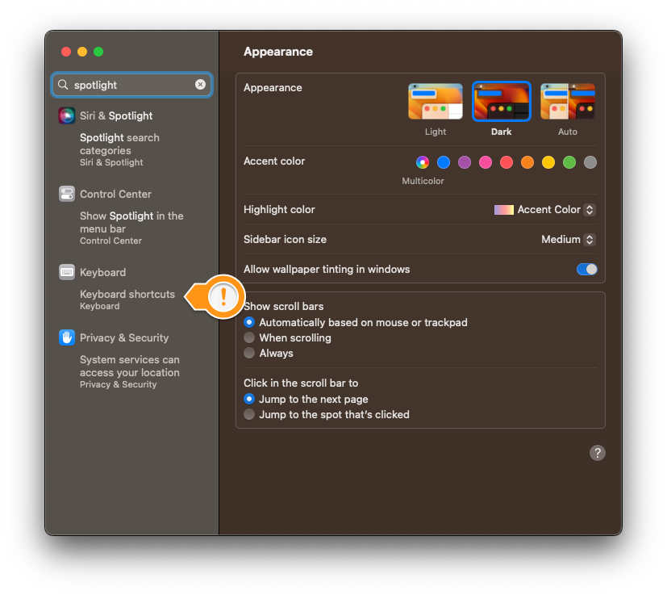
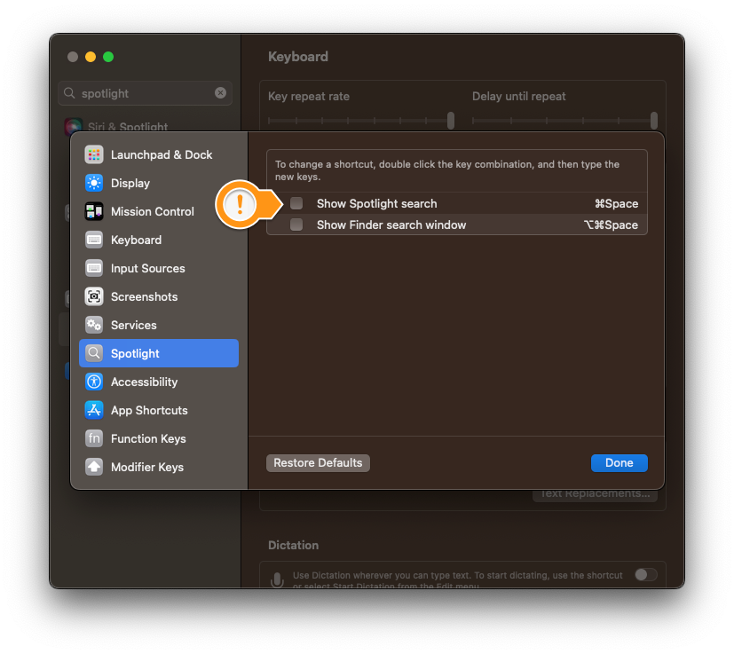

# MacOS Guides

## Disable Spotlight Keyboard Shortcut

1. Open `System Settings`

1. Search `spotlight` and click the `Keyboard shortcuts` result

    

1. Disable the `Show Spotlight search`` shortcut

    